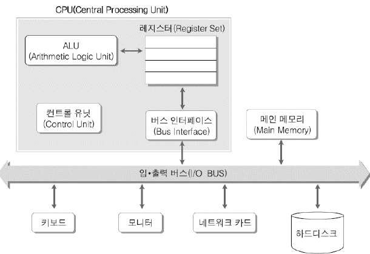
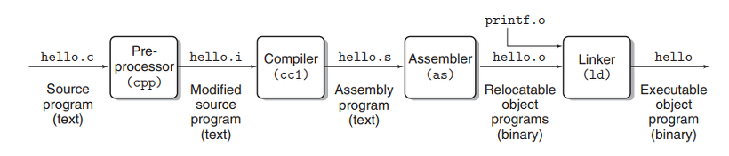
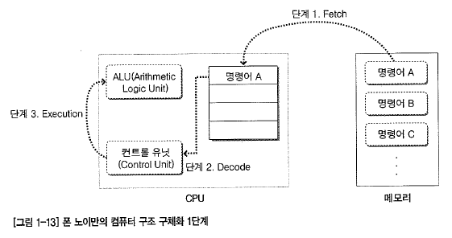
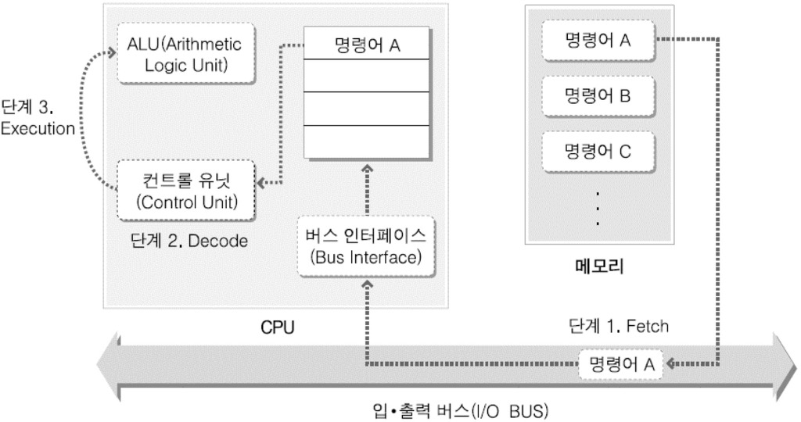

# 시스템 프로그래밍의 정의와 컴퓨터 구조
## 1. 시스템 프로그래밍
* **시스템 프로그램** : Windows, UNIX와 같은 **운영체제**
* **시스템 프로그래밍**
	1. **어셈블리, C 등 하드웨어를 직접 컨트롤**한 개발
	2. **운영체제가 제공하는 라이브러리**를 활용한 개발

## 2. 컴퓨터 구조

* **CPU** : 중앙처리장치
	* **ALU** : **산술 연산과 논리 연산**을 수행하는 블록
	* **컨트롤 유닛** : ALU가 이해할 수 있도록 **명령어를 해석**하고, 해석 결과에 따라 **적절한 신호를 CPU의 다른 블록에 보내는** 구성 요소
	* **레지스터** : CPU 내부에서 임시로 데이터를 저장하기 위한 아주 작고 빠른 메모리
	* **버스 인터페이스** : CPU와 하드, 메인 메모리(RAM) 등이 데이터를 주고받을 수 있도록 I/O 버스의 프로토콜(통신 방식)을 알고 있는 요소
	
* **메인 메모리** : 컴파일 완료된 프로그램 코드가 올라가 실행되는 영역
* **입출력 버스** : 하드웨어 구성 요소 사이에서 데이터를 주고받기 위해 사용되는 경로

> **클럭 신호(Clock Pulse)**
> 
> CPU는 클럭 신호에 맞춰 연산을 한다. 이러한 연산 타이밍을 제공하기 위한 신호를 **클럭 신호**라고 한다.
> 
> CPU 클럭 속도가 1.6MHz라면, 1초에 1,600,000번의 클럭을 발생시킨다는 의미이다. 즉, 1초에 160만 개의 연산을 처리할 수 있게 된다.

## 3. 프로그램 생성 및 실행 과정
### 실행파일 생성 과정

* **전처리기 → 컴파일러 → 어셈블러 → 링커**
	* **전처리기** : #include, #define 등의 전처리문을 처리
	* **컴파일러** : 작성된 C 코드를 어셈블리어로 번역
	* **어셈블러** : 어셈블리어를 바이너리 코드(0, 1)로 번역해 obj 파일을 생성
	* **링커** : obj 파일과 lib 파일을 링크
		* **cpp 파일 하나 당 obj 파일이 하나씩 생성**된다.
---
### 프로그램 실행 과정

> **Fetch → Decode → Execution**
* **Fetch** : 메모리의 명령어를 CPU로 적재하는 작업
* **Decode** : CPU에 적재한 명령어를 Control Unit이 해석하는 단계
* **Execution** : 실제 연산이 ALU에서 처리되는 단계

* **버스 시스템**
	1. **데이터 버스** : *명령어, 피연산자* 등 **데이터를 이동**시키기 위한 버스
	2. **어드레스 버스** : **주소값**을 이동하기 위한 버스
	3. **컨트롤 버스** : CPU와 메모리가 *특정 신호*를 주고받는 용도로 사용되는 버스
